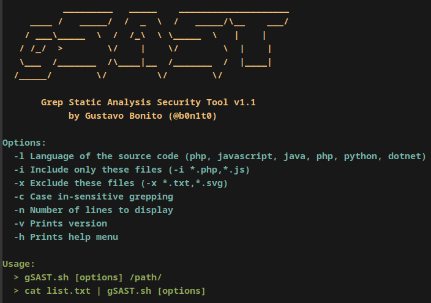

# gSAST - Grep Static Analysis Security Tool

gSAST (Grep Static Analysis Security Tool) is a tool developed for the OSWE certification, utilizing shell scripting (bash) to streamline the process of manual source code analysis.



For a comprehensive demonstration of gSAST, visit [my website](https://gustavobonito.pt/posts/gsast/).

**Note:** Please be aware that gSAST is **not** a vulnerability scanner.

## Usage
To use gSAST, simply provide the path to the directory containing the source code files you want to analyze and the programming language, and optionally the file extension:

```bash
gSAST.sh -l php -i "*.php" /path/to/source/code
cat list.txt | gSAST.sh -l php
```

## FAQ
### Can gSAST be used in the OSWE exam?
gSAST relies on the Linux `grep` utility and pattern files for static analysis, which technically could be used in the OSWE exam. However, it's essential to verify the current allowed toolset on the Offensive Security website as policies may change. Please refer to the ["Exam Restrictions"](https://help.offsec.com/hc/en-us/articles/360046869951-WEB-300-Advanced-Web-Attacks-and-Exploitation-OSWE-Exam-Guide#exam-restrictions) section for the most up-to-date information.